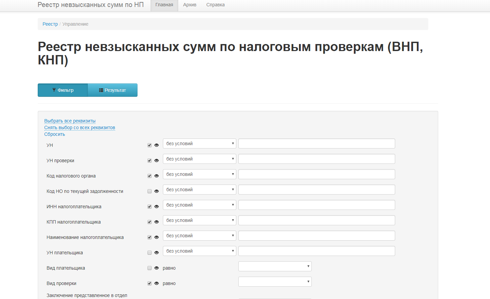

# Реестр не взысканных сумм по налоговым проверкам (ВНП, КНП)

Реестр не взысканных (не в полном объеме взысканных) дополнительно начисленных сумм налогов, по итогам проведения налоговых проверок.
Предназначен для сотрудников контрольных отделов и отделов выездных налоговых проверок.
Реализована возможность просмотра, ввода, редактирования и удаления информации по выездным налоговым проверкам.

## Регламентирующие документы
3781-СЗ@ от 20.08.2015 "О разработке ПО «Реестр проверок»" 

## Зависимости
PHP 5.3, IIS 7, MS SQL Server 2008, Yii 1.1

## Настройки
### База данных
Для настройки подключения к БД необходимо создать файл `\protected\config\db.php` со следующим содержимым:
```php	
return
[
	'connectionString' => 'sqlsrv:Server=DbServerName;Database=DbName',			
	'username' => 'UserName',
	'password' => 'UserPassword',		
	'tablePrefix' => 'arr_',
	'charset' => 'utf8',
	'schemaCachingDuration'=>36000,
];
```
где необходимо заполнить имя сервера, наименование базы данных, логин и пароль для подключения к MS SQL Server

### Каталоги

	\assets - папка генерируемая Yii (с файлами css, js)
	\browsers - исполняемые файлы для установки популярных браузеров
	\css - файлы стилей сайта (css)
	\db - файлы со скриптами для создания структуры БД
	\doc - файлы описания сервиса
	\extension - расширения сайта (css, js)
	\images - изображения сайта
	\js - скрипты сайта (JavaScript)
	\protected - файлы содержащие бизнес логику сайта (шаблон MVC)
	\themes - темы сайта

## Скриншоты
